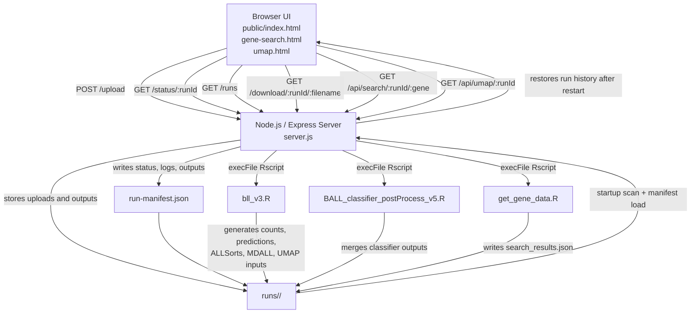

# B-ALL RNA-Seq Classifier

Web application for running the B-ALL RNA-seq classification pipeline from a browser. The app accepts a `quant.sf` file, runs the R-based pipeline, and writes results plus run metadata into a per-run folder under `runs/`.

## Requirements

Before starting, make sure these are installed on the machine:

- Node.js 18 or newer
- npm
- R 4.2 or newer
- `Rscript` available on your `PATH`
- The R packages used by the pipeline:
  - `dplyr`
  - `stringr`
  - `tidyverse`
  - `ALLCatchR`
  - `optparse`
  - `getopt`
  - `progress`
  - `Rphenograph`
  - `SummarizedExperiment`
  - `MDALL`
  - `vroom`
  - `stringi`
  - `reshape2`
  - `jsonlite`
  - `uwot` (optional, used for true UMAP output; otherwise the app falls back to PCA-style coordinates)
- An ALLSorts installation available at:
  - `/opt/anaconda3/envs/allsorts/bin/ALLSorts`

The app also expects a GTF mapping file. By default it uses:

```text
resources/gtf1.txt
```

You can override that with the `GTF_FILE` environment variable.

## Install

1. Clone the repository:

```bash
git clone https://github.com/vyellapa/ball-classifier-web.git
cd ball-classifier-web
```

2. Install Node dependencies:

```bash
npm install
```

3. Install the required R packages. Example:

```r
install.packages(c(
  "dplyr",
  "stringr",
  "tidyverse",
  "optparse",
  "getopt",
  "progress",
  "vroom",
  "stringi",
  "reshape2",
  "jsonlite",
  "uwot"
))
```

Some packages in this project are usually installed from Bioconductor or other project-specific sources, including:

- `SummarizedExperiment`
- `MDALL`
- `ALLCatchR`
- `Rphenograph`

Install those using the method required by your lab or environment.

4. Make sure `resources/gtf1.txt` exists, or set a custom path:

```bash
export GTF_FILE=/absolute/path/to/gtf1.txt
```

5. Confirm ALLSorts is installed where the R script expects it. If your binary is somewhere else, update [scripts/bll_v3.R](/Users/vyellapantula/Downloads/ball-classifier-fixed/scripts/bll_v3.R:1).

## Run

Start the server:

```bash
npm start
```

For development with auto-reload:

```bash
npm run dev
```

The app runs at:

```text
http://localhost:3000
```

## How To Use

1. Open `http://localhost:3000`.
2. Upload a `quant.sf` file.
3. Optionally upload a custom GTF file.
4. Set the run label and confidence thresholds if needed.
5. Start the run and wait for processing to finish.

Results are written to:

```text
runs/<run-id>/
```

Each run directory also stores a `run-manifest.json` file that records:

- Run label
- Status
- Timestamps
- Log output
- Output file list
- Any terminal error message

This means previous runs remain visible in the web UI after a server restart. If the server stops while a pipeline is still running, that run is restored in the UI as `interrupted` on the next startup.

Typical output files include:

- `B-ALL_final_calls_<date>.txt`
- `B-ALL_merged_calls_<date>.txt`
- `MDall_output_<run-label>.txt`
- `counts.csv`
- `counts.v2.csv`
- `predictions.tsv`
- `allsorts_results/probabilities.csv`

## Architecture



At a high level, the browser talks only to the Express server. The server owns file upload, job lifecycle, restart recovery, and execution of the R scripts. Each run is isolated in `runs/<run-id>/`, which contains both the generated analysis files and the persisted `run-manifest.json` used by the UI history.

## Project Layout

```text
.
├── server.js
├── package.json
├── public/
├── resources/
├── runs/
└── scripts/
```

## Notes

- `node_modules/` is only needed in the repository for offline or restricted environments where dependencies cannot be installed during deployment. In normal Git-based workflows, commit `package.json` and `package-lock.json` instead and run `npm install` on the target machine.
- Run history is persisted on disk inside each `runs/<run-id>/run-manifest.json`, so restarting the server does not clear the UI history.
